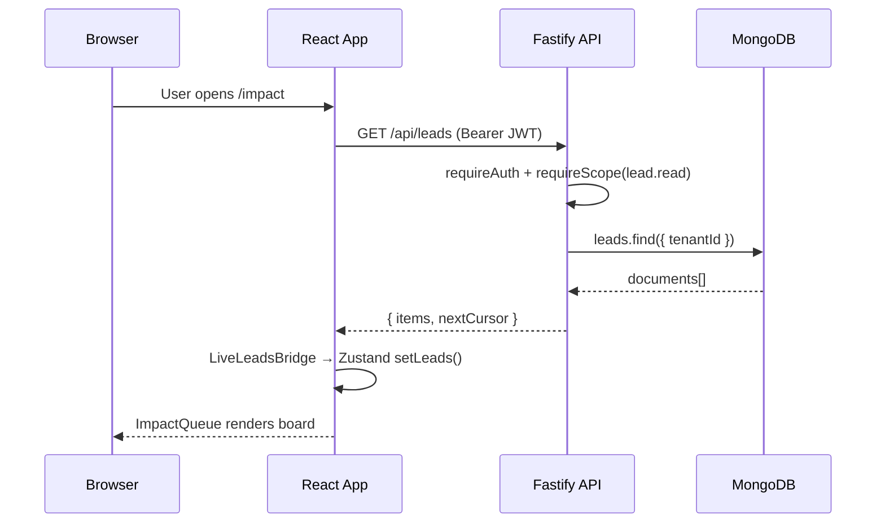
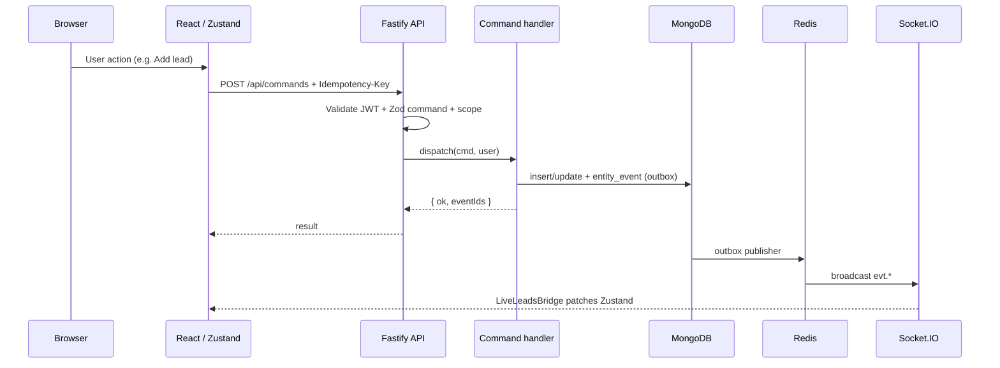
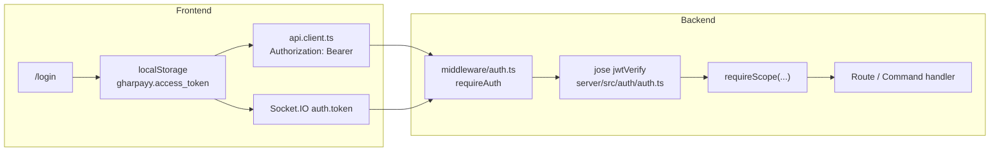
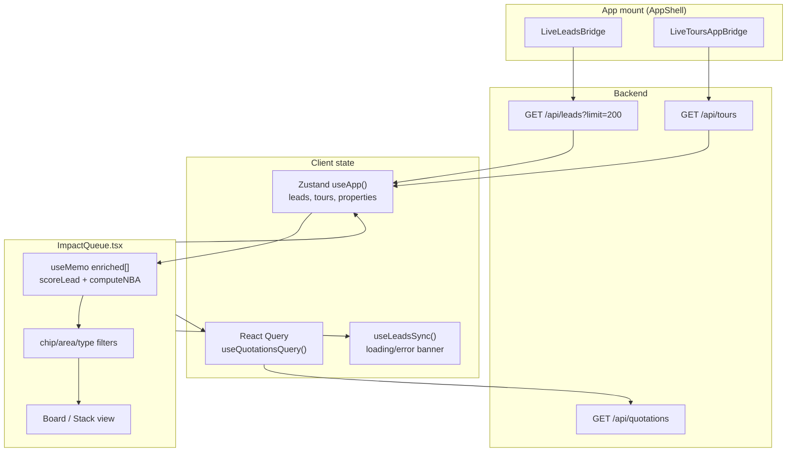
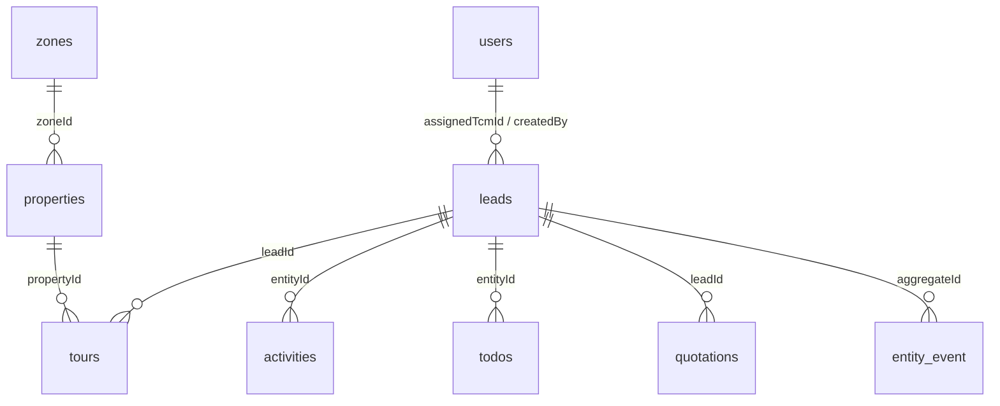
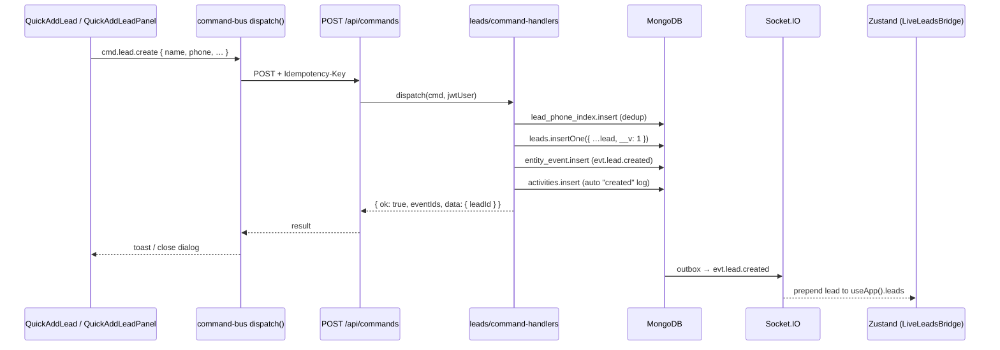

# Gharpayy Ops — Project Overview

> Onboarding guide for engineers new to this codebase. Describes how the frontend, backend, database, and realtime layer fit together end-to-end.

---

## Table of contents

1. [Tech stack](#tech-stack)
2. [High-level architecture](#high-level-architecture)
3. [Frontend structure](#frontend-structure)
4. [Impact Queue data flow](#impact-queue-data-flow)
5. [Backend structure](#backend-structure)
6. [API reference (major resources)](#api-reference-major-resources)
7. [MongoDB collections & schemas](#mongodb-collections--schemas)
8. [End-to-end data flows](#end-to-end-data-flows)
9. [Configuration, environment & security](#configuration-environment--security)
10. [Local development workflow](#local-development-workflow)
11. [Testing & observability](#testing--observability)

---

## Tech stack

| Layer | Technology |
|-------|------------|
| **Frontend** | React 18, TypeScript, **Vite**, **TanStack Router** (file-based routes), **TanStack React Query**, Tailwind CSS, Radix UI (shadcn-style components) |
| **Backend** | **Node.js 20+**, **Fastify 5**, TypeScript (`server/`) |
| **Database** | **MongoDB** (native driver, no Mongoose) |
| **Cache / pub-sub / queues** | **Redis** (Socket.IO adapter, BullMQ, rate limiting in prod) |
| **Realtime** | **Socket.IO** (server → browser domain events) |
| **Validation / contracts** | **Zod** schemas in `src/contracts/` (shared between frontend and server) |
| **Auth** | JWT (HS256 via `jose`), Argon2 password hashing, RBAC scopes |
| **Error reporting** | Optional **Sentry** (`@sentry/react`, `VITE_SENTRY_DSN`) |

This is **not** Next.js or Create React App. The frontend is a Vite SPA with TanStack Start-style routing.

---

## High-level architecture

### Main pieces

```
┌─────────────────────────────────────────────────────────────────────────┐
│  Browser (Gharpayy Ops SPA)                                             │
│  React + Zustand + React Query + Socket.IO client                       │
└───────────────────────────────┬─────────────────────────────────────────┘
                                │ HTTPS  (VITE_API_URL)
                                │ WSS    (same host, Socket.IO)
                                ▼
┌─────────────────────────────────────────────────────────────────────────┐
│  Fastify API server  (server/src/index.ts)                              │
│  • REST reads: /api/leads, /api/tours, …                                │
│  • Command bus: POST /api/commands  (all writes)                        │
│  • Auth: /api/auth/*                                                    │
│  • Middleware: JWT verify, RBAC scopes, rate limit, CORS                │
└───────┬─────────────────────────────┬───────────────────────────────────┘
        │                             │
        ▼                             ▼
┌───────────────┐              ┌────────────────┐
│  MongoDB      │              │  Redis         │
│  (Atlas/VPS)  │              │  pub/sub       │
│  collections  │              │  BullMQ queues │
└───────────────┘              └────────┬───────┘
                                        │
                                        ▼
                               ┌────────────────┐
                               │  Worker        │
                               │  (automation)  │
                               │  server/src/   │
                               │  workers/      │
                               └────────────────┘
```

**External integrations (partial / planned):**

- **Webhooks** ingress at `POST /api/webhooks/:vendor` (WhatsApp, dialer, payments) → `webhooks_in` collection + BullMQ `webhooks_in` queue
- **Property Hub** static catalog in `src/property-genius/data/pgs.ts` (not all properties live in Mongo)
- No dedicated ads integration in-repo at time of writing

### Request flow (read path)



### Request flow (write path — command bus)



### Where auth sits



---

## Frontend structure

### Entry & bundler

| Item | Location |
|------|----------|
| Bundler | **Vite** — `vite.config.ts` (port **3001** in dev) |
| Router root | `src/routes/__root.tsx` — providers (React Query, MYT contexts, AuthGate) |
| Route files | `src/routes/**/*.tsx` — TanStack Router file-based routes |
| Global styles | `src/styles.css` |
| Production serve | `serve.mjs` (after `npm run build`) |

There is no `src/main.tsx` in the classic CRA sense; TanStack Router generates the route tree from `src/routes/`.

### Folder map (`src/`)

| Folder | Purpose |
|--------|---------|
| **`src/routes/`** | Page-level routes. One file ≈ one URL. Examples below. |
| **`src/components/`** | Shared and feature UI. `impact/` = Impact Queue, `leads/` = lead forms, `ui/` = design system (shadcn). |
| **`src/lib/`** | Core app logic: `store.ts` (Zustand), `api/` (HTTP client, command bus, socket, local adapter), `crm10x/` (scoring, templates, property catalog), `types.ts` (UI types). |
| **`src/contracts/`** | **Shared Zod schemas** — Lead, Tour, Command, Event types used by both frontend and server. |
| **`src/hooks/`** | React hooks (`useLiveLeads`, `useActivities`, `useImpactQueueKeyboard`, …). |
| **`src/property-genius/`** | Property Hub UI + static PG catalog (`data/pgs.ts`). |
| **`src/myt/`** | “Manage Your Tours” sub-app (war room, schedule, TCM views). |
| **`src/admin/`** | Admin dashboards, exporters, supreme metrics. |
| **`src/owner/`** | Property-owner portal pages. |
| **`src/supply-hub/`** | Supply / inventory intelligence views. |

### Key routes

| Route file | URL | Feature |
|------------|-----|---------|
| `src/routes/impact.tsx` | `/impact` | **Impact Queue** (main conversion board) |
| `src/routes/today.tsx` | `/today` | Today's focus / do-next queue |
| `src/routes/leads.tsx` | `/leads` | Leads list |
| `src/routes/live-leads.tsx` | `/live-leads` | Live leads view |
| `src/routes/leads.add.tsx` | `/leads/add` | Quick add lead |
| `src/routes/tours.tsx` | `/tours` | Tours |
| `src/routes/property-hub.tsx` | `/property-hub` | Property Hub |
| `src/routes/login.tsx` | `/login` | Authentication |
| `src/routes/admin.*.tsx` | `/admin/...` | Admin surfaces |
| `src/routes/myt/*.tsx` | `/myt/...` | MYT module |

### State management

The app uses **multiple stores** — know which one you're touching:

| Store | File | Holds |
|-------|------|-------|
| **Main CRM state** | `src/lib/store.ts` (Zustand) | `leads`, `tours`, `properties`, `activities`, `bookings`, stage mutations |
| **Auth** | `src/lib/auth-store.ts` | Current user profile |
| **Leads sync status** | `src/lib/leads-sync.ts` | loading / ready / error for API hydration |
| **Lead identity (dedup)** | `src/lib/lead-identity/store.ts` | Separate unified-lead model (persisted locally) |
| **React Query** | various `src/hooks/api/*` | Server cache for stats, tours hooks, etc. |
| **UI prefs** | `src/lib/crm10x/impact-queue-prefs.ts` | Board view, filter prefs (localStorage) |
| **TCM focus pins** | `src/lib/crm10x/tcm-contacts.ts` | Focus inventory property pins (localStorage) |

**Reads:** `LiveLeadsBridge` (`src/components/LiveLeadsBridge.tsx`) fetches `GET /api/leads` on mount and listens to Socket.IO `evt.lead.*` events to keep Zustand in sync.

**Writes:** Almost all mutations go through `dispatch()` in `src/lib/api/command-bus.ts` → `POST /api/commands`.

### API clients

| File | Role |
|------|------|
| `src/lib/api/client.ts` | Main HTTP client, `api.leads.list`, `api.command`, auth helpers |
| `src/lib/api/command-bus.ts` | Typed `dispatch(cmd)` wrapper with ULID idempotency |
| `src/lib/api/socket.ts` | Socket.IO connection + `onEvent()` fan-out |
| `src/lib/api/local-adapter.ts` | **Offline fallback** when `VITE_API_URL` is unset — stores leads/todos in `localStorage` |

---

## Impact Queue data flow

### Component tree

```
/impact  (src/routes/impact.tsx)
  └── FeatureErrorBoundary
        └── AppShell
              ├── LiveLeadsBridge      ← hydrates leads from API
              ├── LiveToursAppBridge   ← hydrates tours
              └── ImpactQueue          ← main UI (src/components/impact/ImpactQueue.tsx)
```

### How Impact Queue gets data



**Step by step:**

1. **`LiveLeadsBridge`** calls `api.leads.list({ limit: 200 })`.
   - Network mode: `GET /api/leads` on the Fastify server.
   - Local mode: reads `localStorage` key `gharpayy.local.leads`.
2. Wire-format leads (`src/contracts/entities.ts` `Lead`) are converted to legacy UI shape via `toLegacy()` / `normalizeLeadRecord()`.
3. Result is stored in **`useApp().leads`** (Zustand).
4. **`ImpactQueue`** reads `leads`, `tours`, `properties` from Zustand and `quotes` from React Query.
5. **Enrichment** happens client-side in `useMemo`: `scoreLead`, `computeNBA`, column assignment (inbox / scheduled / onTour / quoted / booked), chip filters.
6. **Properties** for dossiers come from `property-catalog.ts` — merges Mongo ops properties (`useApp().properties`) with static Property Hub data (`PGS`).

**Realtime updates:** `LiveLeadsBridge` subscribes to `onEvent()` and patches Zustand on `evt.lead.created`, `evt.lead.updated`, `evt.lead.stage_changed`, etc.

---

## Backend structure

### Entry point

**`server/src/index.ts`** — Fastify app bootstrap:

1. Load env (`server/src/config/env.ts`)
2. Connect Mongo (`server/src/db/mongo.ts`)
3. Register plugins: CORS, cookies, rate limit
4. Register routes (auth, health, webhooks, modules)
5. Attach Socket.IO (`server/src/realtime/socket.ts`)
6. Start outbox publisher (`server/src/realtime/event-bus.ts`)
7. Listen on `PORT` (default **4000**)

### Route organisation

| Module | File | Responsibility |
|--------|------|----------------|
| **Leads + command bus** | `server/src/modules/leads/routes.ts` | `POST /api/commands`, `GET /api/leads` |
| **Lead writes** | `server/src/modules/leads/command-handlers.ts` | `cmd.lead.*` handlers |
| **Tours** | `server/src/modules/tours/routes.ts` | `GET /api/tours`, `PATCH /api/tours/:id` |
| **Tour writes** | `server/src/modules/tours/command-handlers.ts` | `cmd.tour.*` handlers |
| **Todos** | `server/src/modules/todos/routes.ts` | `GET /api/todos` |
| **Todo writes** | `server/src/modules/todos/command-handlers.ts` | `cmd.todo.*` |
| **Activities** | `server/src/modules/activities/routes.ts` | `GET /api/activities` |
| **Activity writes** | `server/src/modules/activities/command-handlers.ts` | `cmd.activity.*` |
| **Users** | `server/src/modules/users/routes.ts` | `GET/POST/PATCH /api/users/*` |
| **Properties** | `server/src/modules/properties/routes.ts` | `GET/POST/PATCH/DELETE /api/properties` |
| **Zones** | `server/src/modules/zones/routes.ts` | `GET/POST/PATCH /api/zones` |
| **Quotations** | `server/src/modules/quotations/routes.ts` | `GET/POST /api/quotations`, status updates |
| **Stats** | `server/src/modules/stats/routes.ts` | Leaderboard, KPI aggregations |
| **Activity feed** | `server/src/modules/activity/feed-routes.ts` | Admin event feeds from `entity_event` |
| **Auth** | `server/src/routes/auth.ts` | Login, signup, me, logout |
| **Health** | `server/src/routes/health.ts` | `/healthz`, `/readyz`, `/metrics` |
| **Webhooks** | `server/src/routes/webhooks.ts` | Async webhook ingress |

### Shared middleware

| Middleware | File | Purpose |
|------------|------|---------|
| `requireAuth` | `server/src/middleware/auth.ts` | JWT from `Authorization: Bearer` or `access_token` cookie |
| `requireScope(...)` | same | RBAC check against `req.user.scopes` |
| Rate limit | `@fastify/rate-limit` in `index.ts` | 300 req/min/IP (prod), per-user when authed |
| CORS | `@fastify/cors` | Origins from `CORS_ORIGINS` env |
| Validation | Zod | `Command.safeParse`, per-route body schemas |

### Command bus pattern

**All state changes** go through a single endpoint:

```
POST /api/commands
Headers: Authorization, Idempotency-Key (must equal command._id)
Body: { _id, type, issuedAt, payload }
```

Handlers validate with Zod, write Mongo, append to `entity_event` outbox, return `{ ok, eventIds }`. Idempotency is enforced via `command_ledger` collection (+ Redis fast path).

---

## API reference (major resources)

### Auth

| Method | Path | Description |
|--------|------|-------------|
| POST | `/api/auth/login` | Returns JWT + sets `access_token` cookie |
| POST | `/api/auth/signup` | Create user (dev/bootstrap) |
| GET | `/api/auth/me` | Current user + scopes |
| PATCH | `/api/auth/update` | Update profile/password |
| POST | `/api/auth/logout` | Clear session |

### Leads

| Method | Path | Description |
|--------|------|-------------|
| GET | `/api/leads` | List leads (role-filtered, cursor pagination) |
| GET | `/api/leads/:id` | Single lead |
| POST | `/api/commands` | All writes: create, update, assign, change_stage, delete |

### Tours

| Method | Path | Description |
|--------|------|-------------|
| GET | `/api/tours` | List tours |
| PATCH | `/api/tours/:id` | Direct tour patch (limited; prefer commands) |
| POST | `/api/commands` | schedule, reschedule, cancel, complete, update_post_tour |

### Properties & zones

| Method | Path | Description |
|--------|------|-------------|
| GET | `/api/properties` | List ops properties |
| POST | `/api/properties` | Create property |
| PATCH | `/api/properties/:id` | Update property |
| GET | `/api/zones` | List zones |
| POST/PATCH | `/api/zones` | Manage zones |

### Todos & activities

| Method | Path | Description |
|--------|------|-------------|
| GET | `/api/todos` | List todos |
| GET | `/api/activities` | Timeline for `entityType` + `entityId` |
| POST | `/api/commands` | `cmd.todo.*`, `cmd.activity.*` |

### Quotations

| Method | Path | Description |
|--------|------|-------------|
| GET | `/api/quotations` | List (optional `?leadId=`) |
| POST | `/api/quotations` | Create quotation |
| PUT | `/api/quotations/:id/status` | Update status (sent/paid/…) |

### Users (admin)

| Method | Path | Description |
|--------|------|-------------|
| GET | `/api/users` | List managed users |
| GET | `/api/users/list` | Lightweight list for dropdowns |
| POST | `/api/users` | Create user |
| PATCH | `/api/users/:id` | Update user |

### Health & ops

| Method | Path | Description |
|--------|------|-------------|
| GET | `/api/health` | Simple liveness `{ ok: true }` |
| GET | `/healthz` | Process up |
| GET | `/readyz` | Mongo + Redis + outbox + DLQ checks |
| GET | `/metrics` | Prometheus metrics |

> **Note:** There is no dedicated `bookings` REST resource or Mongo collection. Bookings in the UI (`useApp().bookings`) are client-side state only. A lead reaches **booked** via `cmd.lead.change_stage` with `to: "booked"`.

---

## MongoDB collections & schemas

MongoDB is accessed via the native driver. Collection helper: `col(name)` in `server/src/db/mongo.ts`. Indexes are created on server boot in `ensureIndexes()`.

**Canonical schemas:** `src/contracts/entities.ts` (Zod). Server-specific docs: inline interfaces in route files.

### Collection summary

| Collection | Purpose | Schema source |
|------------|---------|---------------|
| `leads` | Core lead records | `src/contracts/entities.ts` → `Lead` |
| `tours` | Scheduled/completed tours | `src/contracts/entities.ts` → `Tour` |
| `todos` | Tasks (standalone or linked) | `src/contracts/entities.ts` → `Todo` |
| `activities` | CRM activity timeline | `src/contracts/entities.ts` → `Activity` |
| `users` | Auth + org directory | `server/src/auth/auth.ts` → `UserDoc` |
| `properties` | Ops inventory properties | `server/src/modules/properties/routes.ts` → `PropertyDoc` |
| `zones` | Geographic zones | `server/src/modules/zones/routes.ts` → `ZoneDoc` |
| `quotations` | Sent quotes | Inline in `quotations/routes.ts` |
| `entity_event` | Event store / outbox | `server/src/realtime/event-bus.ts` |
| `command_ledger` | Command idempotency (7-day TTL) | `leads/command-handlers.ts` |
| `lead_phone_index` | Phone dedup per tenant | `leads/command-handlers.ts` |
| `aggregate_seq` | Monotonic event seq per aggregate | `event-bus.ts` |
| `webhooks_in` | Raw webhook payloads | `routes/webhooks.ts` |
| `dlq` | Failed BullMQ jobs | `workers/index.ts` |
| `sessions` | Session indexes (legacy/planned) | indexes only |
| `user_roles` | Role indexes (legacy/planned) | indexes only |

### `leads` — key fields & indexes

**Required / important fields:**

```
_id: string (ULID)
tenantId: string
name, phone (E.164), source, budget, moveInDate, preferredArea
stage: new | contacted | tour-scheduled | on-tour | tour-done | …
intent: hot | warm | cold
assignedTcmId, assigneeId, zoneId
createdAt, updatedAt, createdBy
__v: number (optimistic concurrency)
```

**Indexes:** `{ tenantId, createdAt }`, `{ tenantId, phone }`, `{ tenantId, assignedTcmId }`, `{ tenantId, stage }`, `{ tenantId, zoneId, stage }`

### `tours` — key fields

```
_id, tenantId, leadId, propertyId?
assignedTo (TCM user id), scheduledBy, scheduledAt
status: scheduled | confirmed | completed | no-show | cancelled
tourType: physical | virtual | pre-book-pitch
postTour: { outcome, confidence, objection, objectionNote, … }
createdAt, updatedAt
```

**Relation:** `tours.leadId` → `leads._id`

### `users` — key fields

```
_id, username, email, passwordHash, fullName
role: super_admin | manager | admin | member | owner | tcm
status: active | inactive | invited | deleted
zones: string[], tenantId
managerId?, adminId?, adminIds?, memberIds?
```

**Index:** unique `email`

### `activities` — key fields

```
_id, tenantId, entityType, entityId
kind: call | email | note | stage_changed | created | …
subject, body, direction, outcome
occurredAt, actor, meta
```

**Relation:** `entityId` references lead/tour/etc. depending on `entityType`

### Example pseudo-documents

**Lead:**

```json
{
  "_id": "01JABC…",
  "tenantId": "gharpayy",
  "name": "Rahul Sharma",
  "phone": "+919876543210",
  "source": "whatsapp",
  "budget": 12000,
  "preferredArea": "Koramangala",
  "stage": "tour-scheduled",
  "intent": "hot",
  "assignedTcmId": "01JUSER…",
  "confidence": 75,
  "tags": ["urgent"],
  "createdAt": "2026-06-08T10:00:00.000Z",
  "updatedAt": "2026-06-08T11:30:00.000Z",
  "createdBy": "01JUSER…",
  "__v": 3
}
```

**Tour (linked to lead):**

```json
{
  "_id": "01JTOUR…",
  "tenantId": "gharpayy",
  "leadId": "01JABC…",
  "propertyId": "pg-forum-pro-boys",
  "assignedTo": "01JUSER…",
  "scheduledBy": "01JUSER…",
  "scheduledAt": "2026-06-09T11:00:00.000Z",
  "status": "scheduled",
  "tourType": "physical",
  "postTour": {
    "outcome": null,
    "confidence": 0,
    "objection": null,
    "objectionNote": "",
    "filledAt": null
  },
  "createdAt": "2026-06-08T11:30:00.000Z",
  "updatedAt": "2026-06-08T11:30:00.000Z"
}
```

**Booked state (no separate booking collection):**

When a lead is booked, `leads.stage` becomes `"booked"`. Tour `postTour.outcome` may be `"booked"`. Check-in flows use separate client modules (`src/lib/checkins/`).

### Entity relationships (simplified)



---

## End-to-end data flows

### 1. Add lead



**Files to open:**

| Step | File |
|------|------|
| UI trigger | `src/components/leads/QuickAddLeadPanel.tsx` or `ImpactQueue` → `QuickAddLead` |
| Dispatch | `src/lib/api/command-bus.ts` |
| HTTP | `src/lib/api/client.ts` → `api.command` |
| Route | `server/src/modules/leads/routes.ts` |
| Handler | `server/src/modules/leads/command-handlers.ts` → `cmd.lead.create` |
| Schema | `src/contracts/entities.ts` → `Lead` |
| UI sync | `src/components/LiveLeadsBridge.tsx` |

---

### 2. Update lead stage (board column move)

**Flow:** User drags card or uses stage stepper → `useApp().setLeadStage(leadId, stage)` → optimistic Zustand update → `api.command({ type: "cmd.lead.change_stage", payload: { leadId, to } })` → handler updates `leads.stage` + emits `evt.lead.stage_changed` → Socket updates all clients.

| Step | File |
|------|------|
| Optimistic UI | `src/lib/store.ts` → `setLeadStage` |
| Handler | `server/src/modules/leads/command-handlers.ts` → `cmd.lead.change_stage` |
| Realtime | `LiveLeadsBridge` listens `evt.lead.stage_changed` |

**Stage progression (Impact Queue columns):** `new` → `tour-scheduled` → `on-tour` → `tour-done` → `quote-sent` / `negotiation` → `booked` (see `src/lib/types.ts` `LeadStage`).

---

### 3. Schedule tour (from Impact Queue)

**Flow:** Lead drawer / schedule action → `useApp().scheduleTour({ leadId, propertyId, tcmId, scheduledAt })` → `cmd.tour.schedule` → inserts `tours` doc, updates lead stage to `tour-scheduled`, emits `evt.tour.scheduled`.

| Step | File |
|------|------|
| Store action | `src/lib/store.ts` → `scheduleTour` |
| Handler | `server/src/modules/tours/command-handlers.ts` |
| Tours hydration | `src/components/LiveToursAppBridge.tsx` |

---

### 4. Log a call / activity

**Flow:** Impact Queue lead drawer → `cmd.activity.log` with `kind: "call"`, `entityType: "lead"`, `entityId`, `subject`, `body` → `activities` collection + `evt.activity.logged`.

| Step | File |
|------|------|
| UI | `src/components/impact/ImpactQueue.tsx` (activity log actions) |
| Hook | `src/hooks/useActivities.ts` |
| Handler | `server/src/modules/activities/command-handlers.ts` |
| Read back | `GET /api/activities?entityType=lead&entityId=…` |

**Post-tour objections:** `cmd.tour.update_post_tour` updates `tours.postTour.objection` / `objectionNote` via tour command handler.

---

## Configuration, environment & security

### Environment loading

| App | File | Loader |
|-----|------|--------|
| **Frontend** | `.env` at repo root | Vite `import.meta.env.VITE_*` |
| **Backend** | `server/.env` | `dotenv` in `server/src/config/env.ts` |

### Critical variables

**Frontend (`.env`):**

| Variable | Purpose |
|----------|---------|
| `VITE_API_URL` | Backend base URL, e.g. `http://localhost:4000`. **If unset → local mode (localStorage, no Mongo).** |
| `VITE_WS_URL` | Optional Socket.IO URL (defaults to `VITE_API_URL`) |
| `VITE_SENTRY_DSN` | Optional Sentry error reporting |

**Backend (`server/.env`):**

| Variable | Purpose |
|----------|---------|
| `MONGO_URL` | MongoDB connection string (Atlas SRV) |
| `MONGO_DB` | Database name (default `gharpayy`) |
| `REDIS_URL` | Redis for pub/sub, BullMQ, rate limit |
| `JWT_SECRET` | HS256 signing key (≥32 chars) |
| `JWT_ACCESS_TTL` | Access token lifetime (default `15m`) |
| `CORS_ORIGINS` | Comma-separated allowed frontend origins |
| `DEFAULT_TENANT` | Tenant id for bootstrap user |
| `PORT` / `HOST` | Server bind (default `4000` / `0.0.0.0`) |
| `WEBHOOK_SECRET_*` | Optional HMAC secrets for webhook vendors |

See `server/.env.example` and `.env.example` for templates.

### Authentication flow

1. **Login:** `POST /api/auth/login` → server verifies Argon2 hash → `signAccessToken(JwtClaims)` → returns `{ token, user }` + sets httpOnly `access_token` cookie.
2. **Frontend storage:** `localStorage` key `gharpayy.access_token` (`src/lib/api/client.ts` → `tokenStore`).
3. **Requests:** `Authorization: Bearer <token>` on every API call; credentials included for cookies.
4. **Verification:** `server/src/middleware/auth.ts` → `verifyToken()` via `jose`.
5. **Authorization:** `requireScope("lead.read")` etc. — scopes from `src/contracts/roles.ts` `DEFAULT_SCOPES` per role.

### Frontend local storage (what's stored)

| Key | Content |
|-----|---------|
| `gharpayy.access_token` | JWT |
| `gharpayy.local.leads` | Leads (offline/local mode only) |
| `gharpayy.local.todos` | Todos (local mode) |
| `gharpayy.local.activities` | Activities (local mode) |
| `gharpayy.force_local` | `"1"` forces local mode even with API URL |
| `gharpayy.impact.view` | Board vs stack preference |
| TCM focus pins | `src/lib/crm10x/tcm-contacts.ts` (browser persist) |

> **Debugging tip:** If Compass shows **0 leads** but the UI shows leads, check for **Local mode** badge and `gharpayy.local.leads` in DevTools → Application → Local Storage.

---

## Local development workflow

### Prerequisites

- Node.js **20+**
- MongoDB (Atlas or local)
- Redis (recommended: `redis-server` on `127.0.0.1:6379`)

### Start everything

```bash
# Terminal 1 — backend
cd server
cp .env.example .env   # fill MONGO_URL, JWT_SECRET, etc.
npm install
npm run dev            # tsx watch, port 4000

# Terminal 2 — worker (optional, for automation/webhooks)
cd server
npm run worker

# Terminal 3 — frontend
cd ..                  # repo root
cp .env.example .env   # VITE_API_URL=http://localhost:4000
npm install
npm run dev            # Vite, port 3001
```

### Verify

```bash
curl http://localhost:4000/api/health
curl http://localhost:4000/readyz
```

Open `http://localhost:3001/login` → sign in (bootstrap super admin: see `server/src/auth/auth.ts` `ensureDefaultSuperAdmin`).

### Seed data

There is **no dedicated seed script** in-repo. Data is created by:

1. Using the UI (Add lead, create properties via admin)
2. Server bootstrapping **one super admin** user in `users`
3. Zone seed on first access: `ensureSeedZones()` in `server/src/modules/zones/routes.ts`
4. Property Hub static data in `src/property-genius/data/pgs.ts` (always available without Mongo)

### Deployment reference

See `server/README.md` for VPS + PM2 + nginx deployment to production.

---

## Testing & observability

### Tests

| Location | Framework | Run |
|----------|-----------|-----|
| `src/lib/**/*.test.ts` | **Vitest** | `npm test` (repo root) |

Current test files (unit):

- `src/lib/lead-helpers.test.ts`
- `src/lib/crm10x/impact-hard-actions.test.ts`
- `src/lib/crm10x/impact-quote-stale.test.ts`

There are no backend integration tests or e2e tests in-repo at time of writing.

### Logging

| Layer | Mechanism |
|-------|-----------|
| **Backend** | **Pino** via Fastify (`LOG_LEVEL` env). Pretty print in development. |
| **Frontend** | `console.debug` for API requests in DEV mode |
| **Metrics** | `GET /metrics` (Prometheus format) — `server/src/platform/metrics.ts` |

### Health & readiness

| Endpoint | Use |
|----------|-----|
| `GET /api/health` | Quick "is it up?" |
| `GET /readyz` | Mongo ping, Redis ping, outbox backlog, DLQ depth |
| `GET /healthz` | Liveness only |

### Error boundaries & Sentry

**`FeatureErrorBoundary`** (`src/components/FeatureErrorBoundary.tsx`):

- Wraps high-value surfaces (e.g. `/impact`)
- Catches React render errors
- Calls `captureBoundaryError()` → `src/lib/error-reporting.ts`
- Shows retry UI ("Impact Queue is temporarily unavailable")

**Backend errors** return JSON: `{ code, message, details? }` with HTTP status (401, 403, 400, 404, 429, 503).

**`ImpactApiHealthBanner`** (`src/components/impact/ImpactApiHealthBanner.tsx`) surfaces leads sync failures from `useLeadsSync()` when `GET /api/leads` fails.

### When something breaks — checklist

1. **UI shows data, Mongo empty?** → Local mode / wrong `MONGO_DB` / frontend not hitting API.
2. **401 errors?** → Token expired; re-login. Check `gharpayy.access_token`.
3. **403 errors?** → Missing RBAC scope for command type.
4. **Empty board after login?** → `GET /api/leads` role filter; check `assignedTcmId` / zones.
5. **Writes don't persist?** → Confirm `POST /api/commands` returns `{ ok: true }`; check `command_ledger` and server logs.
6. **Realtime not updating?** → Redis running? Socket connected? Check browser console `[ws]` warnings.

---

## Quick file index (start here)

| I want to… | Open |
|------------|------|
| Understand lead shape | `src/contracts/entities.ts` |
| Add a new command | `src/contracts/commands.ts` + handler in `server/src/modules/*/command-handlers.ts` |
| Change Impact Queue UI | `src/components/impact/ImpactQueue.tsx` |
| Change API client | `src/lib/api/client.ts` |
| Change auth / JWT | `server/src/auth/auth.ts`, `server/src/middleware/auth.ts` |
| Change Mongo indexes | `server/src/db/mongo.ts` |
| Change route registration | `server/src/index.ts` |
| Debug empty Mongo | Check `VITE_API_URL`, `MONGO_DB`, `src/lib/api/local-adapter.ts` |

---

*Last updated: June 2026 — reflects codebase at `Gharpayy-Ops` monorepo root.*
